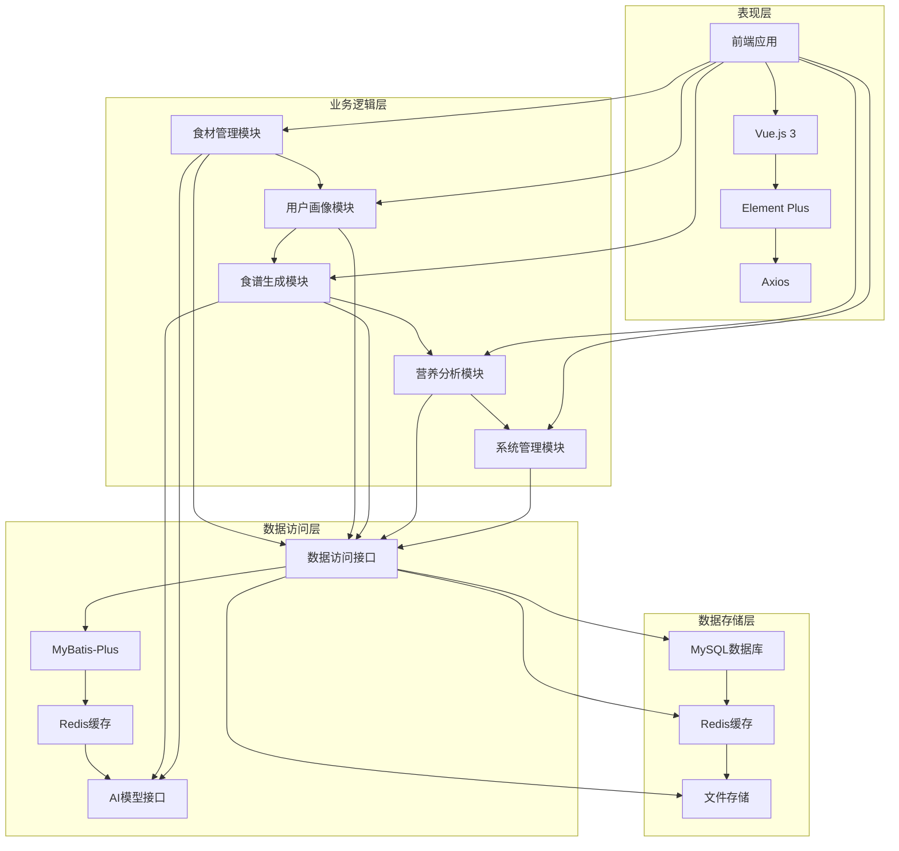
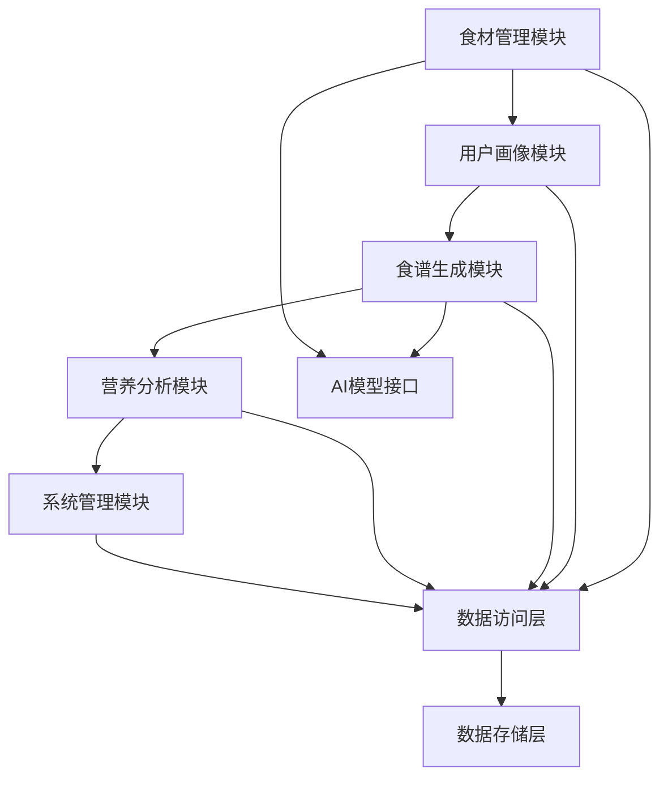
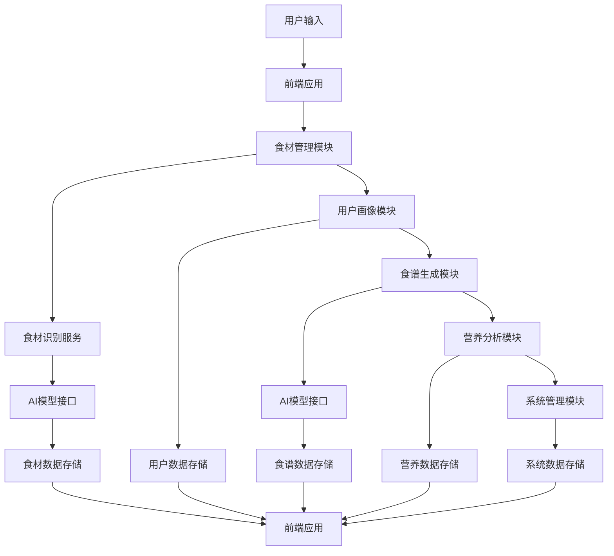

# 基于大模型的个性化食谱生成系统 - 设计文档

## 1. 整体架构图



## 2. 分层设计和核心组件

### 2.1 表现层
- **前端应用**：Vue.js 3作为核心框架，Element Plus提供UI组件库，Axios处理HTTP请求
- **核心组件**：
  - 食材输入组件：支持文本和图像输入
  - 用户画像组件：收集用户信息和偏好
  - 食谱生成组件：展示生成的食谱
  - 营养分析组件：展示营养评估报告
  - 系统管理组件：管理员功能

### 2.2 业务逻辑层
- **食材管理模块**：
  - FoodMaterialService：食材管理服务
  - FoodRecognitionService：食材识别服务
  - FoodSubstituteService：食材替代服务
- **用户画像模块**：
  - UserProfileService：用户画像服务
  - UserPreferenceService：用户偏好服务
- **食谱生成模块**：
  - RecipeGenerateService：食谱生成服务
  - RecipeVerifyService：食谱验证服务
  - RecipeAdjustService：食谱调整服务
- **营养分析模块**：
  - NutritionAnalysisService：营养分析服务
  - NutritionEvaluationService：营养评估服务
  - NutritionSuggestionService：营养建议服务
- **系统管理模块**：
  - SystemManageService：系统管理服务
  - UserManageService：用户管理服务
  - DataUpdateService：数据更新服务
  - LogManageService：日志管理服务

### 2.3 数据访问层
- **数据访问接口**：MyBatis-Plus实现的DAO接口
- **缓存服务**：RedisTemplate操作Redis缓存
- **AI模型接口**：调用阿里云百炼平台API的服务

### 2.4 数据存储层
- **MySQL数据库**：存储结构化数据
- **Redis缓存**：缓存热点数据
- **文件存储**：存储食材图像和食谱图片

## 3. 模块依赖关系图



## 4. 接口契约定义

### 4.1 食材识别接口
- **请求URL**：/api/food/recognize
- **请求方式**：POST
- **请求头**：Content-Type: multipart/form-data; Authorization: Token
- **请求参数**：
  - image：File（食材图像文件）
  - text：String（文本食材信息）
  - type：String（输入类型：image/text/mix）
- **返回格式**：
  ```json
  {
    "code": 200,
    "message": "识别成功",
    "data": {
      "foodList": [
        {
          "id": 1,
          "name": "西红柿",
          "quantity": 200.0,
          "unit": "g",
          "confidence": 0.95,
          "type": "蔬菜"
        }
      ],
      "status": "success"
    }
  }
  ```

### 4.2 食谱生成接口
- **请求URL**：/api/recipe/generate
- **请求方式**：POST
- **请求头**：Content-Type: application/json; Authorization: Token
- **请求参数**：
  ```json
  {
    "userId": 1,
    "foodIds": [1,2,3],
    "expectCount": 3
  }
  ```
- **返回格式**：
  ```json
  {
    "code": 200,
    "message": "生成成功",
    "data": {
      "recipeList": [
        {
          "id": 1,
          "name": "西红柿炒鸡蛋",
          "cookingTime": 15,
          "difficultyLevel": "简单",
          "steps": [
            "1. 西红柿洗净切块，鸡蛋打散备用；",
            "2. 锅中倒油，油热后倒入鸡蛋翻炒至凝固盛出；",
            "3. 锅中留少许油，放入西红柿翻炒出汁，加入鸡蛋炒匀，加盐调味即可。"
          ],
          "foodIds": [1,2,3],
          "collectCount": 120
        }
      ]
    }
  }
  ```

### 4.3 营养分析接口
- **请求URL**：/api/nutrition/analyze
- **请求方式**：GET
- **请求参数**：recipeId（食谱ID）
- **返回格式**：
  ```json
  {
    "code": 200,
    "message": "分析成功",
    "data": {
      "nutritionData": {
        "calorie": 280.5,
        "protein": 15.2,
        "fat": 12.3,
        "carbohydrate": 25.6,
        "vitamin": "维生素C：25mg，维生素E：3.2mg",
        "mineral": "铁：1.5mg，钙：80mg"
      },
      "evaluation": "该食谱热量符合减脂用户每日需求（1500大卡）的18.7%，蛋白质摄入达标，脂肪含量略低，可适当增加优质脂肪摄入",
      "suggestion": "可将50g青菜替换为1个鸡蛋，增加6g蛋白质与3g脂肪，使营养更均衡"
    }
  }
  ```

### 4.4 用户管理接口
- **注册接口**：/api/user/register
- **登录接口**：/api/user/login
- **信息更新接口**：/api/user/update
- **偏好设置接口**：/api/user/preference

### 4.5 系统管理接口
- **用户管理接口**：/api/admin/user
- **数据更新接口**：/api/admin/data
- **日志管理接口**：/api/admin/log

## 5. 数据流向图



## 6. 异常处理策略

### 6.1 前端异常处理
- **网络异常**：提示用户网络连接失败，建议检查网络
- **请求超时**：提示用户请求超时，建议重试
- **服务器错误**：提示用户服务器错误，建议稍后重试
- **参数错误**：提示用户输入参数错误，指导用户正确输入

### 6.2 后端异常处理
- **业务异常**：返回具体的错误信息，如食材识别失败、食谱生成失败等
- **系统异常**：返回通用的错误信息，如服务器内部错误、数据库连接失败等
- **安全异常**：返回未授权、权限不足等错误信息

### 6.3 AI模型异常处理
- **模型调用失败**：返回模型调用失败的错误信息，建议重试
- **识别结果低置信度**：返回低置信度的警告信息，提示用户确认
- **API调用限制**：返回API调用限制的错误信息，建议稍后重试

### 6.4 数据存储异常处理
- **数据库连接失败**：返回数据库连接失败的错误信息，建议检查数据库配置
- **缓存访问失败**：返回缓存访问失败的错误信息，使用数据库作为 fallback
- **文件存储失败**：返回文件存储失败的错误信息，建议检查文件系统权限

## 7. 设计原则

### 7.1 严格按照任务范围，避免过度设计
- 仅实现五大核心模块的功能，不包括外部集成和第三方服务
- 保持系统架构简洁，避免不必要的复杂性

### 7.2 确保与现有系统架构一致
- 采用分层架构设计，融入微服务思想实现核心功能解耦
- 使用指定的技术栈和AI模型，确保与现有系统架构一致

### 7.3 复用现有组件和模式
- 复用现有的前端组件和后端服务
- 采用成熟的设计模式和最佳实践

### 7.4 性能优化
- 页面响应时间≤3秒，食材识别准确率≥90%
- 使用Redis缓存热点数据，提升访问速度
- 优化AI模型调用，减少响应时间

### 7.5 安全设计
- API密钥使用.env文件管理，确保系统安全
- 使用Spring Security保障系统安全
- 实现输入验证，防止恶意输入