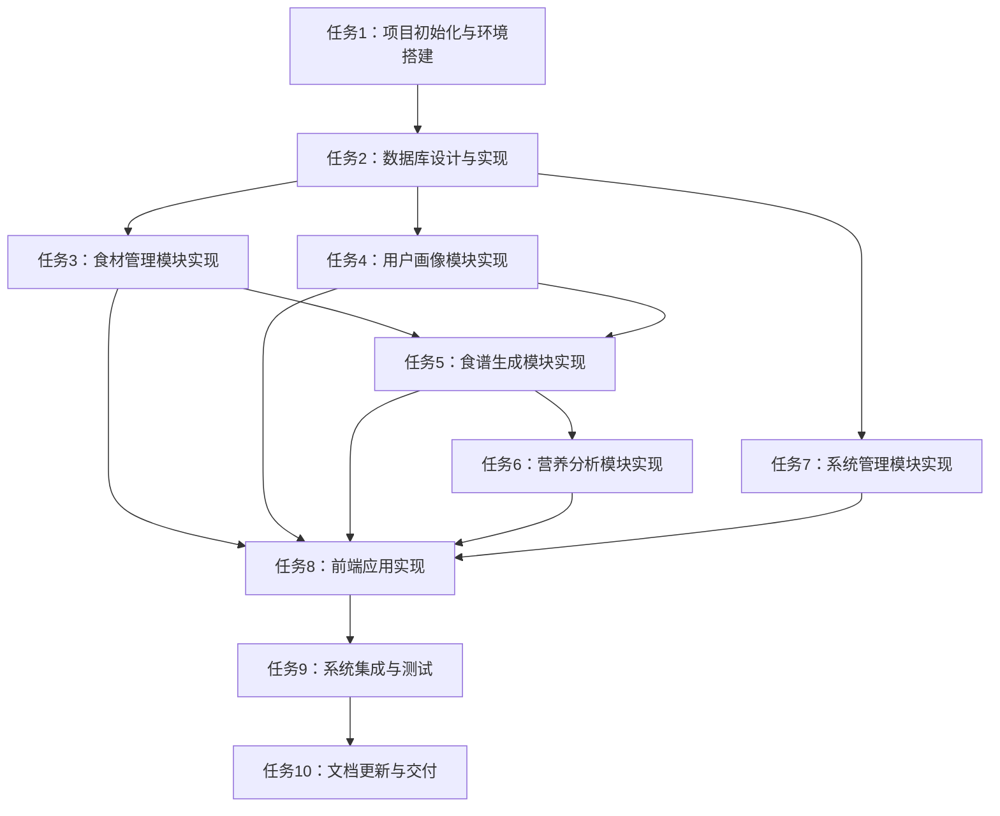

# 基于大模型的个性化食谱生成系统 - 任务文档

## 1. 子任务拆分

### 1.1 任务1：项目初始化与环境搭建
- **输入契约**：
  - 项目目录结构
  - 技术栈选择
  - 开发环境配置
- **输出契约**：
  - 项目初始化完成
  - 环境搭建成功
  - 依赖管理配置完成
- **实现约束**：
  - 使用 Maven 管理依赖
  - 使用 Spring Boot 3 作为开发框架
  - 使用 Vue.js 3 作为前端框架
- **依赖关系**：
  - 前置任务：无
  - 后置任务：任务2、任务3、任务4、任务5、任务6

### 1.2 任务2：数据库设计与实现
- **输入契约**：
  - 数据模型设计
  - 数据库表结构
  - 数据初始化脚本
- **输出契约**：
  - 数据库表创建完成
  - 数据初始化完成
  - 数据库连接配置完成
- **实现约束**：
  - 使用 MySQL 8.0 作为数据库
  - 使用 MyBatis-Plus 作为 ORM 框架
  - 遵循数据模型设计规范
- **依赖关系**：
  - 前置任务：任务1
  - 后置任务：任务3、任务4、任务5、任务6

### 1.3 任务3：食材管理模块实现
- **输入契约**：
  - 食材识别接口设计
  - 食材存储接口设计
  - 食材替代推荐接口设计
- **输出契约**：
  - 食材识别功能实现
  - 食材存储功能实现
  - 食材替代推荐功能实现
- **实现约束**：
  - 支持文本和图像双模态输入
  - 食材识别准确率≥90%
  - 集成 AI 模型接口
- **依赖关系**：
  - 前置任务：任务1、任务2
  - 后置任务：任务4

### 1.4 任务4：用户画像模块实现
- **输入契约**：
  - 用户信息接口设计
  - 用户偏好接口设计
  - 用户画像更新接口设计
- **输出契约**：
  - 用户注册功能实现
  - 用户登录功能实现
  - 用户偏好设置功能实现
  - 用户画像更新功能实现
- **实现约束**：
  - 使用 Spring Security 保障安全
  - 支持画像实时更新
  - 缓存用户画像数据
- **依赖关系**：
  - 前置任务：任务1、任务2
  - 后置任务：任务5

### 1.5 任务5：食谱生成模块实现
- **输入契约**：
  - 食谱生成接口设计
  - 食谱验证接口设计
  - 食谱调整接口设计
- **输出契约**：
  - 食谱生成功能实现
  - 食谱验证功能实现
  - 食谱调整功能实现
  - 食谱收藏功能实现
- **实现约束**：
  - 使用 ChatGLM-4 生成食谱
  - 生成 3-5 个候选食谱
  - 按烹饪熟练度调整步骤详细度
- **依赖关系**：
  - 前置任务：任务1、任务2、任务3、任务4
  - 后置任务：任务6

### 1.6 任务6：营养分析模块实现
- **输入契约**：
  - 营养分析接口设计
  - 营养评估接口设计
  - 营养建议接口设计
- **输出契约**：
  - 营养分析功能实现
  - 营养评估功能实现
  - 营养建议功能实现
- **实现约束**：
  - 计算 28 项核心营养指标
  - 生成符合《中国居民膳食指南》的评估报告
  - 提供可落地的营养调整建议
- **依赖关系**：
  - 前置任务：任务1、任务2、任务5
  - 后置任务：任务7

### 1.7 任务7：系统管理模块实现
- **输入契约**：
  - 用户管理接口设计
  - 数据更新接口设计
  - 日志管理接口设计
- **输出契约**：
  - 用户管理功能实现
  - 数据更新功能实现
  - 日志管理功能实现
- **实现约束**：
  - 支持管理员权限管理
  - 支持食材营养数据库更新
  - 支持操作日志管理
- **依赖关系**：
  - 前置任务：任务1、任务2
  - 后置任务：任务8

### 1.8 任务8：前端应用实现
- **输入契约**：
  - 前端页面设计
  - 前端组件设计
  - 前端接口调用设计
- **输出契约**：
  - 前端页面实现
  - 前端组件实现
  - 前端接口调用实现
- **实现约束**：
  - 使用 Vue.js 3 作为前端框架
  - 使用 Element Plus 作为 UI 组件库
  - 页面响应时间≤3秒
- **依赖关系**：
  - 前置任务：任务3、任务4、任务5、任务6、任务7
  - 后置任务：任务9

### 1.9 任务9：系统集成与测试
- **输入契约**：
  - 系统集成方案
  - 测试用例设计
  - 性能测试方案
- **输出契约**：
  - 系统集成完成
  - 功能测试通过
  - 性能测试通过
- **实现约束**：
  - 系统功能完整
  - 系统性能符合要求
  - 系统安全符合标准
- **依赖关系**：
  - 前置任务：任务1、任务2、任务3、任务4、任务5、任务6、任务7、任务8
  - 后置任务：任务10

### 1.10 任务10：文档更新与交付
- **输入契约**：
  - 项目文档
  - 测试报告
  - 交付物清单
- **输出契约**：
  - 文档更新完成
  - 测试报告生成
  - 交付物准备完成
- **实现约束**：
  - 文档完整准确
  - 测试报告详细
  - 交付物符合要求
- **依赖关系**：
  - 前置任务：任务9
  - 后置任务：无

## 2. 任务依赖图

## 3. 拆分原则

### 3.1 复杂度可控，便于 AI 高成功率交付
- 每个任务的复杂度适中，确保 AI 能够成功完成
- 任务边界清晰，避免任务间的交叉和依赖冲突

### 3.2 按功能模块分解，确保任务原子性和独立性
- 按系统的五大核心模块进行任务分解
- 每个任务对应一个具体的功能模块，确保任务的原子性和独立性

### 3.3 有明确的验收标准，尽量可以独立编译和测试
- 每个任务都有明确的输入和输出契约
- 每个任务都可以独立编译和测试，确保任务的可验证性

### 3.4 依赖关系清晰
- 明确任务间的依赖关系，确保任务按顺序执行
- 避免循环依赖，确保任务执行的顺畅性

## 4. 执行检查清单

### 4.1 完整性
- 任务计划覆盖所有需求
- 每个功能模块都有对应的任务
- 所有技术实现细节都有明确的任务

### 4.2 一致性
- 与前期文档保持一致
- 任务分解与系统设计文档一致
- 任务输入输出契约与接口设计一致

### 4.3 可行性
- 技术方案确实可行
- 任务复杂度适中，能够在合理时间内完成
- 资源需求合理，能够满足任务执行

### 4.4 可控性
- 风险在可接受范围
- 复杂度可控，能够确保任务成功完成
- 进度可跟踪，能够及时发现和解决问题

### 4.5 可测性
- 验收标准明确可执行
- 每个任务都可以独立测试
- 测试用例设计合理，能够覆盖主要功能和边界情况